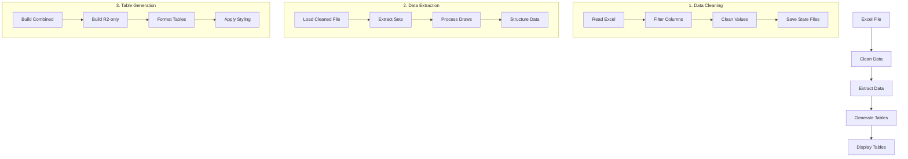
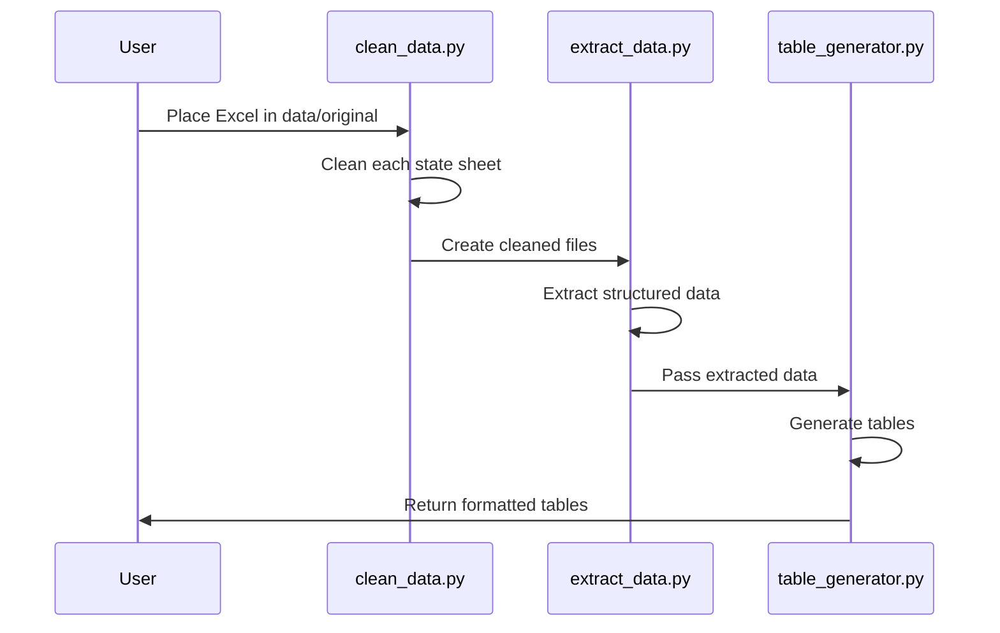

# Lottery Data Table Generation Guide

## Overview

This guide documents the complete process for generating combined tables for all states in the correct format. This is a core part of the system that should remain stable and can be referenced if issues arise.



## 1. Core Scripts

### 1.1 Data Cleaning (`clean_data.py`)

Place this script in `scripts/utils/clean_data.py`:

```python
#!/usr/bin/env python
"""
clean_data.py - Cleans and normalizes Pick3StatsC4.xlsm sheets for all states
"""
import os
import pandas as pd

STATES = [
    "Connecticut4", "Delaware4", "Florida4", "Indiana4",
    "Michigan4", "NewJersey4", "NewYork4", "NorthCarolina4", "Ohio4",
    "OntarioCanada4", "Pennsylvania4", "PuertoRico4", "SouthCarolina4", 
    "Virginia4"
]

def clean_excel_file(input_path, output_path, sheet_name):
    """Clean a single state's sheet from the Excel file"""
    print(f"\nProcessing state: {sheet_name}")
    print(f"Reading file: {input_path}")
    
    try:
        df = pd.read_excel(input_path, sheet_name=sheet_name, dtype=str)
        
        # Define columns to keep
        columns_to_keep = [
            'Q', 'S',  # Midday indicators and draws
            'V', 'W', 'X', 'Y', 'Z', 'AA', 'AB',  # Midday data
            'AD', 'AF',  # Evening indicators
            'AI', 'AJ', 'AK', 'AL', 'AM', 'AN', 'AO',  # Evening data
            'BD',  # Combined indicators
            'BI', 'BJ', 'BK', 'BL', 'BM', 'BN', 'BO'  # Combined data
        ]
        
        # Filter to only existing columns
        existing_columns = [col for col in columns_to_keep if col in df.columns]
        
        if not existing_columns:
            print(f"Error: None of the required columns were found for {sheet_name}")
            return False
            
        print(f"Processing {len(existing_columns)} columns")
        
        # Create cleaned dataframe
        cleaned_df = df[existing_columns]
        
        # Clean the data
        def clean_value(x):
            return str(x).strip() if pd.notnull(x) else ''
        
        cleaned_df = cleaned_df.map(clean_value)
        
        # Save the cleaned file
        cleaned_df.to_excel(output_path, index=False)
        print(f"Cleaned file saved to: {output_path}")
        return True
        
    except Exception as e:
        print(f"Error processing {sheet_name}: {str(e)}")
        return False

def clean_all_states(excel_path, cleaned_dir):
    """Process all states in the Excel file"""
    os.makedirs(cleaned_dir, exist_ok=True)
    
    successful = []
    failed = []
    
    for state in STATES:
        output_path = os.path.join(cleaned_dir, f"{state}_cleaned.xlsx")
        if clean_excel_file(excel_path, output_path, state):
            successful.append(state)
        else:
            failed.append(state)
            
    return successful, failed

def main():
    # Get paths
    current_dir = os.path.dirname(os.path.abspath(__file__))
    project_root = os.path.abspath(os.path.join(current_dir, '..', '..'))
    
    input_path = os.path.join(project_root, 'data', 'original', 'Pick3StatsC4.xlsm')
    cleaned_dir = os.path.join(project_root, 'data', 'cleaned')
    
    if not os.path.exists(input_path):
        print(f"\nError: Input file not found at {input_path}")
        return
        
    successful, failed = clean_all_states(input_path, cleaned_dir)
    
    # Print summary
    print("\n=== Processing Summary ===")
    print(f"Successfully processed {len(successful)} states:")
    for state in successful:
        print(f"✓ {state}")
    
    if failed:
        print(f"\nFailed to process {len(failed)} states:")
        for state in failed:
            print(f"✗ {state}")

if __name__ == "__main__":
    main()
```

### 1.2 Data Extraction (`extract_data.py`)

Place this script in `scripts/utils/extract_data.py`:

```python
#!/usr/bin/env python
"""
extract_data.py - Extracts structured lottery data from cleaned Excel files
"""
import os
import pandas as pd

class LotteryDataExtractor:
    def __init__(self, excel_path):
        print(f"Reading cleaned Excel: {os.path.abspath(excel_path)}")
        self.df = pd.read_excel(excel_path, header=None, dtype=str)
        print(f"DataFrame loaded with shape {self.df.shape}")
        
        # Rename columns to match Excel letters
        col_map = {
            0:'Q',  1:'S',  2:'V',  3:'W',  4:'X',  5:'Y',  6:'Z',  7:'AA', 8:'AB',
            9:'AD', 10:'AF', 11:'AI', 12:'AJ', 13:'AK', 14:'AL', 15:'AM', 16:'AN', 17:'AO',
            18:'BD', 19:'BI', 20:'BJ', 21:'BK', 22:'BL', 23:'BM', 24:'BN', 25:'BO'
        }
        self.df.rename(columns=col_map, inplace=True)

        # Define section configurations
        self.sections = {
            'Midday': {
                'indicator_col': 'Q',
                'data_cols': ['V','W','X','Y','Z','AA','AB'],
                'set_offsets': {1: 3, 2: 49, 3: 95}
            },
            'Evening': {
                'indicator_col': 'AD',
                'data_cols': ['AI','AJ','AK','AL','AM','AN','AO'],
                'set_offsets': {1: 3, 2: 49, 3: 95}
            },
            'Combined': {
                'indicator_col': 'BD',
                'data_cols': ['BI','BJ','BK','BL','BM','BN','BO'],
                'set_offsets': {1: 3, 2: 49, 3: 95}
            }
        }
        
        # Row shift adjustments
        self.shift_adjustments = {
            'Midday': {2: 1, 3: 2},
            'Evening': {2: 1, 3: 2},
            'Combined': {2: 1, 3: 2}
        }
    
    def extract_set1(self, section):
        """Extract Set1 data (7 draws with column slicing)"""
        config = self.sections[section]
        base_row = config['set_offsets'][1]
        all_draws = {}
        
        for draw_num in range(1, 8):
            row = base_row + (draw_num - 1) * 6
            cols = config['data_cols'][draw_num - 1:]

            try:
                data = {
                    'draw_data': [str(x).strip().zfill(3) for x in self.df.loc[row, cols]],
                    'R2': [str(x).strip() for x in self.df.loc[row + 1, cols]],
                    'R4': [str(x).strip() for x in self.df.loc[row + 2, cols]],
                    'R6': [str(x).strip() for x in self.df.loc[row + 3, cols]],
                    'R8': [str(x).strip() for x in self.df.loc[row + 4, cols]]
                }
                all_draws[f"Draw{draw_num}"] = data
            except Exception as e:
                print(f"Error extracting {section} Set1 Draw{draw_num}: {e}")
                
        return all_draws

    def extract_single_draw(self, section, set_num):
        """Extract single draw data for Set2 or Set3"""
        config = self.sections[section]
        base = config['set_offsets'][set_num]
        shift = self.shift_adjustments[section][set_num]
        actual_base = base - shift
        cols = config['data_cols']
        
        try:
            data = {
                'draw_data': [str(x).strip().zfill(3) for x in self.df.loc[actual_base, cols]],
                'R2': [str(x).strip() for x in self.df.loc[actual_base + 1, cols]],
                'R4': [str(x).strip() for x in self.df.loc[actual_base + 2, cols]],
                'R6': [str(x).strip() for x in self.df.loc[actual_base + 3, cols]],
                'R8': [str(x).strip() for x in self.df.loc[actual_base + 4, cols]]
            }
        except Exception as e:
            print(f"Error extracting {section} Set{set_num} Draw1: {e}")
            data = {}
            
        return {"Draw1": data}
    
    def extract_all(self):
        """Extract all data from the Excel file"""
        all_data = {}
        for section in ['Midday', 'Evening', 'Combined']:
            all_data[section] = {}
            
            # Extract Set1 (7 draws)
            all_data[section]["Set1"] = self.extract_set1(section)
            
            # Extract Set2 and Set3 (single draws)
            all_data[section]["Set2"] = self.extract_single_draw(section, set_num=2)
            all_data[section]["Set3"] = self.extract_single_draw(section, set_num=3)

        return all_data

def process_state(state_name, cleaned_dir):
    """Process a single state's cleaned file"""
    excel_path = os.path.join(cleaned_dir, f"{state_name}_cleaned.xlsx")
    if not os.path.exists(excel_path):
        print(f"Warning: File not found for {state_name}: {excel_path}")
        return None
    
    try:
        print(f"\nProcessing {state_name}...")
        extractor = LotteryDataExtractor(excel_path)
        data = extractor.extract_all()
        print(f"✓ Successfully processed {state_name}")
        return data
    except Exception as e:
        print(f"Error processing {state_name}: {str(e)}")
        return None

def process_all_states(cleaned_dir):
    """Process all state files in the cleaned directory"""
    results = {}
    
    if not os.path.exists(cleaned_dir):
        print(f"Error: Cleaned directory not found: {cleaned_dir}")
        return results
    
    for state in STATES:
        data = process_state(state, cleaned_dir)
        if data:
            results[state] = data
    
    return results
```

### 1.3 Table Generation (`table_generator.py`)

Place this script in `scripts/utils/table_generator.py`:

```python
#!/usr/bin/env python
"""
table_generator.py - Generates formatted lottery tables
"""
import pandas as pd

def build_section_table_simple(section_data):
    """Build combined table with columns [Set, Draw, RowType, 7,6,5,4,3,2,1]"""
    columns = ["Set", "Draw", "RowType", "7", "6", "5", "4", "3", "2", "1"]
    records = []

    def add_row(set_label, draw_label, row_type, values):
        # Right-align with N/A padding
        vals = list(values)
        if len(vals) < 7:
            needed = 7 - len(vals)
            vals = ["N/A"] * needed + vals
        elif len(vals) > 7:
            vals = vals[:7]
            
        rec = {
            "Set": set_label,
            "Draw": draw_label,
            "RowType": row_type,
            "7": vals[0],
            "6": vals[1],
            "5": vals[2],
            "4": vals[3],
            "3": vals[4],
            "2": vals[5],
            "1": vals[6]
        }
        records.append(rec)

    # Process Set3 -> Draw1
    if "Set3" in section_data and "Draw1" in section_data["Set3"]:
        d = section_data["Set3"]["Draw1"]
        if "draw_data" in d:
            add_row("Set3", "Draw1", "DRAW_DATA", d["draw_data"])
        for rt in ["R2", "R4", "R6", "R8"]:
            if rt in d:
                add_row("Set3", "Draw1", rt, d[rt])

    # Process Set2 -> Draw1
    if "Set2" in section_data and "Draw1" in section_data["Set2"]:
        d = section_data["Set2"]["Draw1"]
        if "draw_data" in d:
            add_row("Set2", "Draw1", "DRAW_DATA", d["draw_data"])
        for rt in ["R2", "R4", "R6", "R8"]:
            if rt in d:
                add_row("Set2", "Draw1", rt, d[rt])

    # Process Set1 -> Draw1 to Draw7
    if "Set1" in section_data:
        for draw_num in range(1, 8):
            dk = f"Draw{draw_num}"
            if dk in section_data["Set1"]:
                d = section_data["Set1"][dk]
                if draw_num == 1 and "draw_data" in d:
                    add_row("Set1", dk, "DRAW_DATA", d["draw_data"])
                for rt in ["R2", "R4", "R6", "R8"]:
                    if rt in d:
                        add_row("Set1", dk, rt, d[rt])

    return pd.DataFrame(records, columns=columns)

def custom_r2_slice(set_label, draw_label, r2_list):
    """Custom slice for R2 data based on Set and Draw"""
    vals = list(r2_list)
    if set_label in ["Set3", "Set2"] and draw_label == "Draw1":
        return vals[:3]
    if set_label == "Set1":
        try:
            dnum = int(draw_label.replace("Draw", ""))
        except:
            dnum = 0
        if dnum == 1:
            return vals[:3]
        elif dnum == 2:
            return vals[:2]
        else:
            return vals[:1]
    return vals

def build_r2_only_table_simple(section_data):
    """Build R2-only table with columns [Set, Draw, 7,6,5,4,3,2,1]"""
    columns = ["Set", "Draw", "7", "6", "5", "4", "3", "2", "1"]
    records = []

    def add_r2_row(slabel, dlabel, r2_values):
        # Apply custom slice and right-align
        sliced = custom_r2_slice(slabel, dlabel, r2_values)
        if len(sliced) > 7:
            sliced = sliced[:7]
        elif len(sliced) < 7:
            needed = 7 - len(sliced)
            sliced = ["N/A"] * needed + sliced
        
        rec = {
            "Set": slabel,
            "Draw": dlabel,
            "7": sliced[0],
            "6": sliced[1],
            "5": sliced[2],
            "4": sliced[3],
            "3": sliced[4],
            "2": sliced[5],
            "1": sliced[6]
        }
        records.append(rec)

    # Process all sets
    if "Set3" in section_data and "Draw1" in section_data["Set3"]:
        d = section_data["Set3"]["Draw1"]
        if "R2" in d:
            add_r2_row("Set3", "Draw1", d["R2"])
    
    if "Set2" in section_data and "Draw1" in section_data["Set2"]:
        d = section_data["Set2"]["Draw1"]
        if "R2" in d:
            add_r2_row("Set2", "Draw1", d["R2"])
    
    if "Set1" in section_data:
        for draw_num in range(1, 8):
            dk = f"Draw{draw_num}"
            if dk in section_data["Set1"]:
                d = section_data["Set1"][dk]
                if "R2" in d:
                    add_r2_row("Set1", dk, d["R2"])

    return pd.DataFrame(records, columns=columns)
```

## 2. Directory Structure

```
lottery_project/
├── data/
│   ├── original/
│   │   └── Pick3StatsC4.xlsm    # Daily Excel file
│   └── cleaned/                  # Auto-generated state files
│       ├── Connecticut4_cleaned.xlsx
│       ├── Delaware4_cleaned.xlsx
│       └── [other state files]
├── scripts/
│   └── utils/
│       ├── clean_data.py        # Data cleaning
│       ├── extract_data.py      # Data extraction
│       └── table_generator.py   # Table generation
└── docs/
    └── TABLE_GENERATION_GUIDE.md # This guide
```

## 3. Process Flow



## 4. Running the Process

1. Place your Excel file:
```bash
cp Pick3StatsC4.xlsm data/original/
```

2. Clean the data:
```bash
python scripts/utils/clean_data.py
```

3. Generate tables:
```python
from scripts.utils.extract_data import process_state
from scripts.utils.table_generator import build_section_table_simple, build_r2_only_table_simple

# Process a state
state_data = process_state("Connecticut4", "data/cleaned")

# Generate tables for each section
for section in ["Midday", "Evening", "Combined"]:
    if section in state_data:
        # Build combined table
        combined_df = build_section_table_simple(state_data[section])
        
        # Build R2-only table
        r2_df = build_r2_only_table_simple(state_data[section])
```

## 5. Table Formats

### 5.1 Combined Table Format
- Columns: [Set, Draw, RowType, 7, 6, 5, 4, 3, 2, 1]
- Shows all data (draw_data, R2, R4, R6, R8)
- Right-aligned with "N/A" padding
- Ordered: Set3 -> Set2 -> Set1

### 5.2 R2-only Table Format
- Columns: [Set, Draw, 7, 6, 5, 4, 3, 2, 1]
- Shows only R2 rows
- Custom slicing rules:
  - Set3/Set2 Draw1: First 3 items
  - Set1 Draw1: First 3 items
  - Set1 Draw2: First 2 items
  - Set1 Draw3-7: First 1 item

## 6. Troubleshooting

Common issues and solutions:

1. **Missing Columns**
   - Verify Excel column names match expected letters
   - Check `columns_to_keep` in clean_data.py

2. **Row Offset Issues**
   - Verify `set_offsets` in extract_data.py
   - Check `shift_adjustments` for Set2/Set3

3. **Table Format Issues**
   - Ensure right-alignment with "N/A" padding
   - Verify custom R2 slicing rules

4. **File Path Issues**
   - Use absolute paths or proper relative paths
   - Verify directory structure matches documentation

## 7. Maintenance

To keep the table generation process stable:

1. Never modify the core column mappings
2. Maintain consistent row offsets
3. Keep the R2 slicing rules unchanged
4. Regularly backup working versions
5. Test with sample data before processing real files 