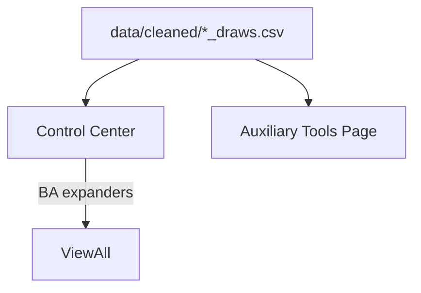

# AAT9 - Auxiliary Tools (Official Overview)

Abstract

The Auxiliary area integrates working-style analytics that operate directly on per-state draws CSVs (data/cleaned/*_draws.csv). It is deliberately separated from the combined string-table pipeline that powers V-TRAC, Stable Pattern, and Digit Reduction.

Scope & Pages

- Auxiliary Tools page: runs per-state analyses; optional BA panel per state.
- Control Center: cross-state table (e.g., doubles view plus Blackapple Alerts) using only draws CSVs.

Data Contracts

- Draws source: `data/cleaned/*_draws.csv` (newest-first, 3-char strings).
- Variants: Combined / Midday / Evening draws via `modules.aux_loaders.load_state_draws(state, variant)` (Combined remains the baseline).
- Normalization: underscores / trailing "4" are handled (`Ontario4` vs `Ontario`, `New_Jersey` vs `NewJersey4`).
- Combined tables (Excel) are not consumed by Aux features.

Wiring & Isolation

- Staged working modules (if any) remain available for Aux parity logic.
- Blackapple is imported via absolute-path loader to avoid `modules` name collisions.
- No refactors to other tool packages are required to operate Aux.

Control Center Map

- Doubles summary: reads all draws CSVs -> builds ranked table.
  - Top-5 V-TRAC double families per state (variant badges + severity) mirror the Aux Hot Families panel and replace the ad-hoc pair/combo columns.
- V-TRAC heatboard: hazard-ranked index metrics (draws-since, avg gap, freq <=100/101-200, trend) appear in both Control Center and Aux for quick pressure scans.
- Sums analytics: per-sum buckets expose `deficit` (hit pct minus expected) and `z_tail` (cold-side z) for downstream scoring without altering current UI.
- Blackapple Alerts: for each state, loads draws -> BA analyzer -> table row with status/triggers/#candidates/examples -> expander for full list.
Positional Pressure

- Aux page panel shows All-Variant (Combined), Midday, Evening grids side-by-side; the 360-draw window + Top-K/pool caps live in `core/aux_config.POS_SHORTLIST_CONFIG` and surface in the UI caption/tuning expander.
- Shortlist builder unifies cartesian union, repeat-endcap lanes, and lane concordance groups (SSOT defaults: topk=3, pool=6, max_internal=64, max_rows=16) and lets operators toggle each feature per state.
- Candidates now ship with structured evidence (per-position ranks + lane marks, repeat-endcap lane notes, V-TRAC nudges) and tag hot families/indices for downstream scoring.
- V-TRAC overlay data (top overdue indexes + double families) is shared with Control Center via `_rank_double_families`, keeping Aux recommendations and state dashboards aligned.
- Implementation remains in `modules/module_d_auxiliary_tools/refactored/positional_tool.py` with Streamlit wiring in `src/app.py`; inputs stay `data/cleaned/*_draws.csv`.
- Hard-due styling unchanged: All-Variant digits flag red at >=55 draws, Midday/Evening at >=40 draws, with tags such as `XVAR-Cons`, `Mirror-Echo`, and `Double-Pressure`.
- Overdue pair analysis continues to use the shared 360-draw window (`PAIRS_ANALYSIS_WINDOW`) so color thresholds stay consistent across captions and smokes.

Operational Notes

- Launch from project root (BAT with quoted pushd, optional PYTHONPATH, venv activation).
- Streamlit hot-reload: avoid global sys.path insertions; BA uses absolute-path loader to guarantee project module resolution.
- Caching: optional lightweight caching for repeated reads (not mandatory to operate).

Troubleshooting

- No rows: verify draws CSVs exist; check `.cvs` typos.
- Import errors: confirm BA loader helpers exist; print BA module `__file__` in a debug expander.
- Wrong cwd: BAT should pushd to repo root before launching.

Mermaid

Future Notes

- Consider renaming staged aux package to avoid top-level `modules` conflicts.
- Optional state BA panels once Control Center is stable and trusted.
