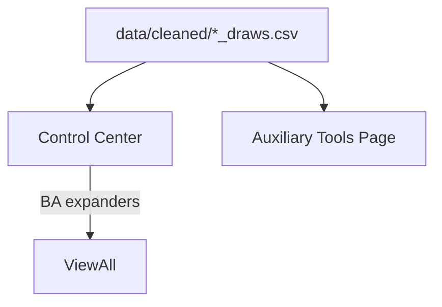

# AAT9 - Auxiliary Tools (Official Overview)

Abstract

The Auxiliary area integrates working-style analytics that operate directly on per-state draws CSVs (data/cleaned/*_draws.csv). It is deliberately separated from the combined string-table pipeline that powers V-TRAC, Stable Pattern, and Digit Reduction.

Scope & Pages

- Auxiliary Tools page: runs per-state analyses; optional BA panel per state.
- Control Center: cross-state table (e.g., doubles view plus Blackapple Alerts) using only draws CSVs.

Data Contracts

- Draws source: `data/cleaned/*_draws.csv` (newest-first, 3-char strings).
- Variants: Combined / Midday / Evening draws via `modules.aux_loaders.load_state_draws(state, variant)` (Combined remains the baseline).
- Normalization: underscores / trailing "4" are handled (`Ontario4` vs `Ontario`, `New_Jersey` vs `NewJersey4`).
- Combined tables (Excel) are not consumed by Aux features.

Wiring & Isolation

- Staged working modules (if any) remain available for Aux parity logic.
- Blackapple is imported via absolute-path loader to avoid `modules` name collisions.
- No refactors to other tool packages are required to operate Aux.

Control Center Map

- Doubles summary: reads all draws CSVs -> builds ranked table.
- Blackapple Alerts: for each state, loads draws -> BA analyzer -> table row with status/triggers/#candidates/examples -> expander for full list.
Positional Pressure

- Aux page panel shows Combined / Midday / Evening side-by-side (P1/P2/P3 columns, top-3 ranks with gap/score/tags).
- Window fixed at 360 draws with Top-3 ranks; outputs include cross-variant consensus notes and a ranked positional shortlist.
- Control Center reuses the same engine to show a compact positional heat badge per state/variant.
- Implementation lives in `modules/module_d_auxiliary_tools/refactored/positional_tool.py`; inputs remain `data/cleaned/*_draws.csv`.
- Hard-due styling: Combined digits turn red at >=55 draws; Midday/Evening at >=40 draws; tags surface as `XVAR-Cons(...)`, `Mirror-Echo(...)`, and `Double-Pressure`.
- Overdue pair analysis reuses a shared 360-draw window (`PAIRS_ANALYSIS_WINDOW`) so RED (>=107) / BLUE (>=71) thresholds align across captions and smokes.

Operational Notes

- Launch from project root (BAT with quoted pushd, optional PYTHONPATH, venv activation).
- Streamlit hot-reload: avoid global sys.path insertions; BA uses absolute-path loader to guarantee project module resolution.
- Caching: optional lightweight caching for repeated reads (not mandatory to operate).

Troubleshooting

- No rows: verify draws CSVs exist; check `.cvs` typos.
- Import errors: confirm BA loader helpers exist; print BA module `__file__` in a debug expander.
- Wrong cwd: BAT should pushd to repo root before launching.

Mermaid

Future Notes

- Consider renaming staged aux package to avoid top-level `modules` conflicts.
- Optional state BA panels once Control Center is stable and trusted.
