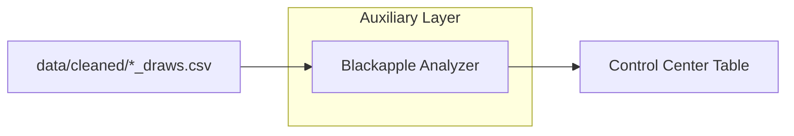

# AAT9 — Blackapple Module Guide

Abstract

Blackapple (BA) is an auxiliary scoring layer that analyzes each state’s most‑recent draw history and surfaces a small, ranked candidate list when multiple evidence signals overlap. It renders primarily on the Control Center page (cross‑state view). A state‑level panel is optional and can be enabled later.

Position in App Flow

- Data source: per‑state draws CSVs under `data/cleaned/*_draws.csv` (newest‑first, 3‑char strings).
- Pages:
  - Control Center: “Blackapple Alerts (All States)” table (primary surface).
  - Auxiliary Tools (optional): “Blackapple Alert” panel (per‑state, when the Aux analysis runs).

Wiring (Imports, Data, Isolation)

- Absolute‑path loader (Option A; current):
  - In `src/app.py`, BA is imported by absolute path via small helpers:
    - `_load_blackapple_real()` → loads `modules/blackapple.py` from the project root.
    - `_load_aux_loaders_real()` → loads `modules/aux_loaders.py` (CSV loader).
  - Reason: remove the “modules” name collision risk with staged aux packages.
- Draws loader:
  - `modules/aux_loaders.load_state_draws(state_label)`
  - CSV‑first, tolerant matching for underscores and trailing “4”; returns `(draws, source_path)`.
  - Only CSV is used for BA; no Excel fallback (avoids string‑table confusion).

Blackapple Signals (Triggers)

- Mirror: latest draw contains a mirror pair (0/5, 1/6, 2/7, 3/8, 4/9).
- Root due: longest‑out digital root among recent draws (1..9) — candidates matching that root get weight.
- Pattern due:
  - Extreme (SSS/TTT) gap due, and/or
  - Mixed group (SST/STS/TSS) gap due.
- Floating digits: digits absent in the last N (e.g., 5) draws — combos including floats get weight.
- Remaining pairs foundation (~27–29): base list from non‑repeating pairs still “out”, used to filter/weight boxed singles.

Scoring & Output

- Inputs: newest‑first draw list (typ. last 100–1000).
- Score: add small weights for each active trigger a combo matches; rank descending.
- Cap: `TOP_N_CANDIDATES = 12` (Control Center shows top 3 as “Examples” for readability; full 12 appear in an expander).
- Status: BA‑Score 0–5; OFF (0–1), WATCH (2), ALERT (≥3).

Control Center UI (Primary Surface)

- Table columns: State | BA‑Score | Status | Triggers | #Candidates | Examples (first 3).
- Under the table, each state has an expander “View all candidates” showing all 12 (combo, score, tags).
- Draw source caption can be surfaced during dev to validate data origin.

Optional State Panel (Aux Page)

- Mirrors Control Center logic per state after Aux analysis runs:
  - Status + BA‑Score | Triggers line | full candidates table (12) with tags.
  - “BA draws: <csv path> (N)” caption shown for verification during development.

Operational Notes

- Launch via `run_app.bat` at project root (quoted pushd; optional PYTHONPATH; activate venv).
- Combined tables (string‑grid Excel) power V‑TRAC/Stable Pattern/Digit Reduction; BA does not use those.
- BA relies only on `data/cleaned/*_draws.csv` (newest‑first).

Troubleshooting

- “No module named modules.blackapple”: modules name collision (staged vs project). Fixed by absolute‑path loader.
- “No candidates”: verify state’s `*_draws.csv` exists; check `.cvs` typos and rename to `.csv`.
- Path surprises: ensure BAT pushd to repo root; optional “System Health” expander shows `cwd`, `sys.executable`, and BA module `__file__`.

Mermaid (Context)

Checklist (Operator)

- Verify draws CSV present under `data/cleaned` for target states.
- Launch app (BAT at root) → Control Center.
- Validate BA rows: Status/Triggers consistent with recent draws.
- Expand a state to see all 12 candidates + tags.
- If unexpected: check “System Health” expander and data filenames.

Future Enhancements

- Optional state panels in Aux page.
- Show candidate tags inline in Control Center “Examples” (space‑aware pill).
- Winners logging / daily summary writer; threshold calibration.
