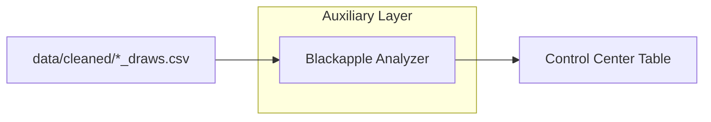

# AAT9 — Blackapple Module Guide

Abstract

Blackapple (BA) is an auxiliary scoring layer that analyzes each state’s most‑recent draw history and surfaces a small, ranked candidate list when multiple evidence signals overlap. It renders primarily on the Control Center page (cross‑state view). A state‑level panel is optional and can be enabled later.

Position in App Flow

- Data source: per‑state draws CSVs under `data/cleaned/*_draws.csv` (newest‑first, 3‑char strings).
- Pages:
  - Control Center: “Blackapple Alerts (All States)” table (primary surface).
  - Auxiliary Tools (optional): “Blackapple Alert” panel (per‑state, when the Aux analysis runs).

Wiring (Imports, Data, Isolation)

- Absolute‑path loader (Option A; current):
  - In `src/app.py`, BA is imported by absolute path via small helpers:
    - `_load_blackapple_real()` → loads `modules/blackapple.py` from the project root.
    - `_load_aux_loaders_real()` → loads `modules/aux_loaders.py` (CSV loader).
  - Reason: remove the “modules” name collision risk with staged aux packages.
- Draws loader:
  - `modules/aux_loaders.load_state_draws(state_label)`
  - CSV‑first, tolerant matching for underscores and trailing “4”; returns `(draws, source_path)`.
  - Only CSV is used for BA; no Excel fallback (avoids string‑table confusion).

Blackapple Signals (Triggers)

- Mirror: latest draw contains a mirror pair (0/5, 1/6, 2/7, 3/8, 4/9).
- Root due: longest‑out digital root among recent draws (1..9) — candidates matching that root get weight.
- Pattern due:
  - Extreme (SSS/TTT) gap due, and/or
  - Mixed group (SST/STS/TSS) gap due.
- Floating digits: digits absent in the last N (e.g., 5) draws — combos including floats get weight.
- Remaining pairs foundation (~27–29): base list from non‑repeating pairs still “out”, used to filter/weight boxed singles.

Scoring & Output

- Inputs: newest‑first draw list (typ. last 100–1000).
- Score: add small weights for each active trigger a combo matches; rank descending.
- Cap: `TOP_N_CANDIDATES = 12` (Control Center shows top 3 as “Examples” for readability; full 12 appear in an expander).
- Status: BA‑Score 0–5; OFF (0–1), WATCH (2), ALERT (≥3).

Control Center UI (Primary Surface)

- Table columns: State | BA‑Score | Status | Triggers | #Candidates | Examples (first 3).
- Under the table, each state has an expander “View all candidates” showing all 12 (combo, score, tags).
- Draw source caption can be surfaced during dev to validate data origin.

Optional State Panel (Aux Page)

- Mirrors Control Center logic per state after Aux analysis runs:
  - Status + BA‑Score | Triggers line | full candidates table (12) with tags.
  - “BA draws: <csv path> (N)” caption shown for verification during development.

Operational Notes

- Launch via `run_app.bat` at project root (quoted pushd; optional PYTHONPATH; activate venv).
- Combined tables (string‑grid Excel) power V‑TRAC/Stable Pattern/Digit Reduction; BA does not use those.
- BA relies only on `data/cleaned/*_draws.csv` (newest‑first).

Troubleshooting

- “No module named modules.blackapple”: modules name collision (staged vs project). Fixed by absolute‑path loader.
- “No candidates”: verify state’s `*_draws.csv` exists; check `.cvs` typos and rename to `.csv`.
- Path surprises: ensure BAT pushd to repo root; optional “System Health” expander shows `cwd`, `sys.executable`, and BA module `__file__`.

Mermaid (Context)

Checklist (Operator)

- Verify draws CSV present under `data/cleaned` for target states.
- Launch app (BAT at root) → Control Center.
- Validate BA rows: Status/Triggers consistent with recent draws.
- Expand a state to see all 12 candidates + tags.
- If unexpected: check “System Health” expander and data filenames.

Future Enhancements

- Optional state panels in Aux page.
- Show candidate tags inline in Control Center “Examples” (space‑aware pill).
- Winners logging / daily summary writer; threshold calibration.

_________________________________________

additional Notes

1) “27–29” isn’t a pair—it’s a method (the “remaining‑pairs” foundation)

What it means: Start with the 55 canonical digit‑pairs for Pick‑3 (00–09 … 99, where pairs are unordered like 16, 27, 49, plus the 10 doubles). Scan the recent draws newest → older and cross off every pair you see inside each draw’s three internal pairs (ab, ac, bc). Stop when ~27–29 pairs remain.
These ~27–29 “remaining pairs” are treated as the foundation. From them you build a compact list of boxed singles (three distinct digits) whose all three internal pairs are still in the remaining set. That becomes the starter list Blackapple filters/weights.

Why it’s used: In BA’s forum workflow, “one of the remaining pairs will hit almost every day.” Using the foundation focuses you on a smaller, mechanically derived universe before you layer other signals.

How your tool uses it: In our analyzer this is the “Remaining‑pairs foundation (27–29 method)” trigger. We compute the remaining set, generate the boxed singles that respect it, and tag those candidates with PAIR. That foundation list is then filtered/scored by the other BA triggers (mirror, root sum due, pattern due, floating digits).

Quick intuition example: If the latest draws were 162, 349, 708, we’d cross off pairs {12,16,26}, {34,39,49}, {07,08,78}. A candidate like 167 is only allowed if 16, 17, 67 are all still in the remaining set. You don’t need every detail to use it—just remember “27–29” is the count target for what’s left after crossing off.

2) Root sum (a.k.a. digital root) and the “3‑6‑9” talk

Digital root (RS): Add a combo’s digits until one digit remains.
Examples: 641 → 6+4+1 = 11 → 1+1 = RS 2; 258 → 2+5+8=15 → 1+5 = RS 6.

Why BA mentions it: Root sums are a staple in his posts (“root sum X due / will fall”). You’ll also see people group 3/6/9 together because they’re multiples of 3; some like to watch that cluster as a rhythm. Our software doesn’t give 3‑6‑9 special status by itself—it simply finds whichever root sum(s) are longest‑out and treats those as due. Combos whose RS matches a due value get a RS tag and extra weight.

How your tool uses it: In the BA table you’ll see a Root due field (e.g., “Root 7”). That list comes from scanning recent draws and picking the longest‑out digital root(s). Any candidate whose RS is in that due set gets boosted in the ranking.

3) Where these fit in the Blackapple scoring you shipped

The module turns five repeatable forum ideas into triggers and then ranks candidates by how many at‑once they satisfy:

Mirror event (latest draw includes any mirror pair 0↔5, 1↔6, 2↔7, 3↔8, 4↔9).

Root sum due (the longest‑out digital root(s), often seen as “Root X”).

Pattern due (Spike/Trough extremes SSS/TTT overdue, or the big SST/STS/TSS group absent longer than normal).

Floating digits (digits not seen in the last N draws).

Remaining‑pairs foundation (27–29 method) (the base set described above).

Status rule: We compute a BA‑Score (0–5) and show OFF (0–1), WATCH (2), ALERT (≥3).

Candidates: Start from the remaining‑pairs foundation and filter/weight by the active triggers (candidates get tags like PAIR, MIR, RS, PAT, FLT). We cap the list (e.g., top 12), and the Control Center shows the top‑3 “Examples” for readability with a “view all” expander for the full set.

4) Putting it together in plain language

“27–29” is your mechanical winnow—it shrinks the universe to sane, boxed singles that respect the pairs still “alive.”

“Root sum due” is your sums overlay—if RS 7 (or yes, sometimes a 3‑6‑9 cluster) is longest‑out, you favor combos whose RS matches it.

When those overlap with Mirror, Pattern, and Floating conditions, the state moves from OFF → WATCH → ALERT, and your table shows a small, ranked list you can actually play or analyze.

If you want, I can also jot a one‑page “reader” you can pin near the Control Center that explains each tag (PAIR/MIR/RS/PAT/FLT) with a single example line so anyone glancing at the Blackapple panel knows exactly why a combo is on the list.

________________________________________________________________________

You’re asking three things, all tightly related:

What “pair 27–29” means and how BA uses it.

What’s special (or not) about root sums 3‑6‑9, and how that relates to SUNS / Sums tracking.

Whether to add a specific “3‑6‑9 stack” alert to Blackapple, and how you’d tune it.

Below I break each down and then give you a concrete, low‑risk spec you can hand to Codex if you decide to add that alert later.

1) “Pair 27–29” — what it actually means

The idea: in Pick‑3, each draw has 3 digits and therefore 3 internal, unordered pairs (e.g., draw 1‑2‑6 contains pairs 12, 16, 26). If you look back over a recent window (say the last 100–200 draws for a state) and collect all distinct unordered pairs that have not appeared in that window, you get the remaining‑pairs set (sometimes called “out pairs”).

There are 45 possible unordered pairs from digits 0–9 (C(10,2) = 45).

As draws go by, that remaining‑pairs set shrinks and grows.

Community shorthand like “27–29” refers to the size of the remaining‑pairs set being in the high‑20s (e.g., 27, 28, 29). Some players believe that when the number of out pairs sits ~27–29, the odds of a “target” pair popping soon are high.

How BA uses it:
Blackapple uses “remaining pairs” as a foundation filter and weight, not as a prediction by itself:

When forming candidate combos, BA prefers boxed triples whose internal pairs are all or mostly inside the remaining‑pairs set (e.g., 1‑2‑6 is favored if 12, 16, 26 are still out).

That remaining‑pairs screen keeps the candidate list focused and is why your #Candidates often tops out at 12 (the cap) when other triggers also line up.

This is a structural cue; other triggers (Mirror, Root due, Pattern due, Floating digits) then boost or re‑rank those candidates.

2) Root sums, the 3‑6‑9 cluster, and SUNS/Sums tracking
Digital root (root sum) in a sentence

Take the sum of the digits and collapse it to a single digit by summing until one digit remains (mod‑9 arithmetic, treating 9 as 9, not 0).
Examples:

1+2+6 = 9 → RS 9

0+3+5 = 8 → RS 8

2+7+9 = 18 → 1+8 = 9 → RS 9

Why people talk about 3‑6‑9

3, 6, and 9 are all multiples of 3. Players notice rhythms in mod‑3 / mod‑9 space: there are stretches where sums that reduce to 3/6/9 appear to “cycle.” This can be partly real (some short‑term autocorrelation) and partly perception (humans spot patterns fast). In practical terms:

Sometimes the cluster {3,6,9} as “due” is just a special case of a regular root‑due condition: if the longest‑out digital root happens to be 3, 6 or 9, you will see that call‑out.

There’s nothing inherently magical about 3‑6‑9; it’s simply a popular cluster to watch because of mod‑3 rhythms. The right way to use it is evidence‑based: if the longest‑out digital root sits in {3,6,9} and other triggers also line up, then the stack matters.

How BA already uses root sums

BA doesn’t hard‑code any special love for 3‑6‑9. It:

Scans your recent draws, finds the longest‑out digital root(s) (could be 7, could be 9, etc.), and tags that as Root X due.

Any candidate whose RS matches a due value gets RS+ weight.

If other triggers (Mirror, Pattern, Floats, Remaining‑pairs) overlap, the BA‑Score moves from OFF → WATCH → ALERT.

How to “extend SUNS/Sums tracking”

If you want to go deeper than “root due,” extend the sums layer with three simple, stable checks:

Absolute sum gap due (sum 0..27 for Pick‑3): longest‑out absolute sum group (e.g., 12–15).

Mod‑3 state / streaks: is the current run starved of sums ≡ 0 (mod 3) (i.e., the 3‑6‑9 family)? Track the gap since last 3/6/9 and the typical waiting time for that state.

Mod‑9 gap due: same concept but at digital‑root granularity (1..9), which you already have — just keep the gap length and maybe a rolling hazard estimate (see tuning below).

None of that conflicts with BA; it enriches the root‑due trigger so it’s quantitative rather than folklore.

3) Should we add a 3‑6‑9‑specific alert? (and how)

Short answer: Yes, as an opt‑in, stacked trigger — only when multiple pieces line up. Treat it like a bonus on top of what BA already does, not a new theory that overrides everything else.

A clean, low‑risk spec (“369 Stack”)

Name (UI Triggers column): 369‑Stack
What it means: A 3‑6‑9 root‑cluster push coincides with at least one other strong BA signal.

Default rule (conservative): Fire 369‑Stack when all of the following hold:

Root‑due in {3,6,9}: the longest‑out digital root set intersects {3,6,9}.

Recency pressure: gap since last 3/6/9 ≥ median historical gap for that state or exceeds a fixed threshold (e.g., ≥ 7 draws).

Any one strong co‑signal among:

Mirror occurred on the latest draw,

Pattern due (extreme) SSS/TTT flagged, or

Floats include a multiple‑of‑3 digit (3,6,9) and that digit appears in the candidate.

Scoring effect: +1 BA‑Score (so a WATCH can move to ALERT when other triggers exist).
Candidate tagging (per combo): add RS3/RS6/RS9 tag and a small weight if the combo’s RS ∈ {3,6,9}.
Display: in Control Center “Triggers,” append 369‑Stack when active.

Why this is safe: you are not “forcing” 3‑6‑9; you’re saying when it’s due and something else is also hot, give it a nudge.

Tuning knobs (so you can “tinker” safely later)

Windows:

Root‑due window: 120–200 draws is typical; 150 is a good first pass.

Float window: 5–7 draws.

Thresholds:

Recency: “gap ≥ median gap” (robust to outliers), or a fixed 7–10 draws.

Weights:

Base RS‑match: +0.5;

369‑Stack fired: +1.0 (to the state BA‑Score), and +0.2 to each matching candidate.

Strict mode (optional): only award the candidate boost if all three internal pairs of the combo are in the remaining‑pairs set (ties back to your 27–29 foundation).

What about the “95% hit” claim?

Treat that as motivating lore, not a target. If you want numbers:

Backtest each state with a rolling split (e.g., train on years 1–2, test on year 3; then slide).

Log precision@12 (did the day’s winner appear in the 12?), coverage (how often we issue ALERT), and lead time (did it hit within k draws of an alert?).

Compare BA vs. BA+369‑Stack to see if the alert quality improves (higher precision for the same or lower coverage).

How this informs the settings you tweak

If you want fewer but sharper alerts:

Raise the co‑signal requirement for 369‑Stack from “any one” to “any two,” or require Strict remaining‑pairs (all 3 pairs out).

Increase float window from 5 to 7 (harder for floats to trigger).

If you want more exploration (richer list):

Keep the cap at 12, but lower RS boost from +0.5 to +0.2 so RS is supportive, not dominant.

Allow the 369‑Stack to fire on “gap ≥ 75th percentile” or “Mirror+Mixed pattern (SST/STS/TSS)” even if RS9 isn’t the single longest‑out (but still in top‑2).

If you’re chasing short bursts (day‑trader style):

Shrink windows (root‑due 100; float 3–5) and give slightly more weight to Mirror and Floats; keep 369‑Stack but require a co‑signal so you don’t over‑fire.

Why extending SUNS/Sums beyond “3‑6‑9 folklore” helps

Quantifies the intuition: instead of “3‑6‑9 feels hot,” you log an actual gap and compare it to that state’s typical gaps.

Combines with structure: by insisting on remaining‑pairs coverage you keep candidates anchored to recent market structure, not just a sum story.

Plugs into BA cleanly: it’s one more stackable trigger, with small weights and a clear UI label.

A tiny pseudo‑logic block (so you can hand it to Codex later)

Not asking you to implement now—this is the exact shape that slots into BA without breaking anything.

if root_due intersects {3,6,9}:
    rs369_due = True
    gap = draws_since_last_root_in({3,6,9})
    due_enough = (gap >= median_gap369[state]) or (gap >= 7)

    co_signal = mirror_flag or pattern.extreme_due or (any(d in floats for d in {3,6,9}))

    if due_enough and co_signal:
        triggers.append("369-Stack")
        BA_score += 1
        for cand in candidates:
            if root_sum(cand) in {3,6,9}:
                cand.score += 0.2
                cand.tags.add(f"RS{root_sum(cand)}")

All of the variables above already exist in your BA flow (root‑due set, pattern flags, float set, candidate loop); this just adds a gated, modest boost and a label.

Bottom line

27–29 is about remaining‑pairs coverage; BA already uses that as a structural base.

3‑6‑9 is a root‑sum cluster some players watch; the right way to use it is as a stacked trigger only when it’s actually due and at least one other BA signal is hot.

If you want it, add 369‑Stack exactly as above: small boost, conservative gating, clear UI label.

Tuning is just windows + thresholds + tiny weights. Validate with a simple rolling backtest so you know whether BA+369 helps your precision without spamming alerts.

If you want, I can turn the spec above into a one‑page “BA‑369 addendum” you can paste into your repo docs so every future AI knows exactly how (and how not) to wire it.