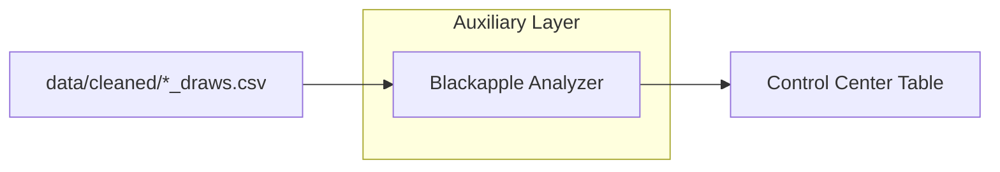

# AAT9 — Blackapple Module Guide

Abstract

Blackapple (BA) is an auxiliary scoring layer that analyzes each state’s most‑recent draw history and surfaces a small, ranked candidate list when multiple evidence signals overlap. It renders primarily on the Control Center page (cross‑state view). A state‑level panel is optional and can be enabled later.

Position in App Flow

- Data source: per‑state draws CSVs under `data/cleaned/*_draws.csv` (newest‑first, 3‑char strings).
- Pages:
  - Control Center: “Blackapple Alerts (All States)” table (primary surface).
  - Auxiliary Tools (optional): “Blackapple Alert” panel (per‑state, when the Aux analysis runs).

Wiring (Imports, Data, Isolation)

- Absolute‑path loader (Option A; current):
  - In `src/app.py`, BA is imported by absolute path via small helpers:
    - `_load_blackapple_real()` → loads `modules/blackapple.py` from the project root.
    - `_load_aux_loaders_real()` → loads `modules/aux_loaders.py` (CSV loader).
  - Reason: remove the “modules” name collision risk with staged aux packages.
- Draws loader:
  - `modules/aux_loaders.load_state_draws(state_label)`
  - CSV‑first, tolerant matching for underscores and trailing “4”; returns `(draws, source_path)`.
  - Only CSV is used for BA; no Excel fallback (avoids string‑table confusion).

Blackapple Signals (Triggers)

- Mirror: latest draw contains a mirror pair (0/5, 1/6, 2/7, 3/8, 4/9).
- Root due: longest‑out digital root among recent draws (1..9) — candidates matching that root get weight.
- Pattern due:
  - Extreme (SSS/TTT) gap due, and/or
  - Mixed group (SST/STS/TSS) gap due.
- Floating digits: digits absent in the last N (e.g., 5) draws — combos including floats get weight.
- Remaining pairs foundation (~27–29): base list from non‑repeating pairs still “out”, used to filter/weight boxed singles.

Scoring & Output

- Inputs: newest‑first draw list (typ. last 100–1000).
- Score: add small weights for each active trigger a combo matches; rank descending.
- Cap: `TOP_N_CANDIDATES = 12` (Control Center shows top 3 as “Examples” for readability; full 12 appear in an expander).
- Status: BA‑Score 0–5; OFF (0–1), WATCH (2), ALERT (≥3).

Control Center UI (Primary Surface)

- Table columns: State | BA‑Score | Status | Triggers | #Candidates | Examples (first 3).
- Under the table, each state has an expander “View all candidates” showing all 12 (combo, score, tags).
- Draw source caption can be surfaced during dev to validate data origin.

Optional State Panel (Aux Page)

- Mirrors Control Center logic per state after Aux analysis runs:
  - Status + BA‑Score | Triggers line | full candidates table (12) with tags.
  - “BA draws: <csv path> (N)” caption shown for verification during development.

Operational Notes

- Launch via `run_app.bat` at project root (quoted pushd; optional PYTHONPATH; activate venv).
- Combined tables (string‑grid Excel) power V‑TRAC/Stable Pattern/Digit Reduction; BA does not use those.
- BA relies only on `data/cleaned/*_draws.csv` (newest‑first).

Troubleshooting

- “No module named modules.blackapple”: modules name collision (staged vs project). Fixed by absolute‑path loader.
- “No candidates”: verify state’s `*_draws.csv` exists; check `.cvs` typos and rename to `.csv`.
- Path surprises: ensure BAT pushd to repo root; optional “System Health” expander shows `cwd`, `sys.executable`, and BA module `__file__`.

Mermaid (Context)

Checklist (Operator)

- Verify draws CSV present under `data/cleaned` for target states.
- Launch app (BAT at root) → Control Center.
- Validate BA rows: Status/Triggers consistent with recent draws.
- Expand a state to see all 12 candidates + tags.
- If unexpected: check “System Health” expander and data filenames.

Future Enhancements

- Optional state panels in Aux page.
- Show candidate tags inline in Control Center “Examples” (space‑aware pill).
- Winners logging / daily summary writer; threshold calibration.

_________________________________________

additional Notes

1) “27–29” isn’t a pair—it’s a method (the “remaining‑pairs” foundation)

What it means: Start with the 55 canonical digit‑pairs for Pick‑3 (00–09 … 99, where pairs are unordered like 16, 27, 49, plus the 10 doubles). Scan the recent draws newest → older and cross off every pair you see inside each draw’s three internal pairs (ab, ac, bc). Stop when ~27–29 pairs remain.
These ~27–29 “remaining pairs” are treated as the foundation. From them you build a compact list of boxed singles (three distinct digits) whose all three internal pairs are still in the remaining set. That becomes the starter list Blackapple filters/weights.

Why it’s used: In BA’s forum workflow, “one of the remaining pairs will hit almost every day.” Using the foundation focuses you on a smaller, mechanically derived universe before you layer other signals.

How your tool uses it: In our analyzer this is the “Remaining‑pairs foundation (27–29 method)” trigger. We compute the remaining set, generate the boxed singles that respect it, and tag those candidates with PAIR. That foundation list is then filtered/scored by the other BA triggers (mirror, root sum due, pattern due, floating digits).

Quick intuition example: If the latest draws were 162, 349, 708, we’d cross off pairs {12,16,26}, {34,39,49}, {07,08,78}. A candidate like 167 is only allowed if 16, 17, 67 are all still in the remaining set. You don’t need every detail to use it—just remember “27–29” is the count target for what’s left after crossing off.

2) Root sum (a.k.a. digital root) and the “3‑6‑9” talk

Digital root (RS): Add a combo’s digits until one digit remains.
Examples: 641 → 6+4+1 = 11 → 1+1 = RS 2; 258 → 2+5+8=15 → 1+5 = RS 6.

Why BA mentions it: Root sums are a staple in his posts (“root sum X due / will fall”). You’ll also see people group 3/6/9 together because they’re multiples of 3; some like to watch that cluster as a rhythm. Our software doesn’t give 3‑6‑9 special status by itself—it simply finds whichever root sum(s) are longest‑out and treats those as due. Combos whose RS matches a due value get a RS tag and extra weight.

How your tool uses it: In the BA table you’ll see a Root due field (e.g., “Root 7”). That list comes from scanning recent draws and picking the longest‑out digital root(s). Any candidate whose RS is in that due set gets boosted in the ranking.

3) Where these fit in the Blackapple scoring you shipped

The module turns five repeatable forum ideas into triggers and then ranks candidates by how many at‑once they satisfy:

Mirror event (latest draw includes any mirror pair 0↔5, 1↔6, 2↔7, 3↔8, 4↔9).

Root sum due (the longest‑out digital root(s), often seen as “Root X”).

Pattern due (Spike/Trough extremes SSS/TTT overdue, or the big SST/STS/TSS group absent longer than normal).

Floating digits (digits not seen in the last N draws).

Remaining‑pairs foundation (27–29 method) (the base set described above).

Status rule: We compute a BA‑Score (0–5) and show OFF (0–1), WATCH (2), ALERT (≥3).

Candidates: Start from the remaining‑pairs foundation and filter/weight by the active triggers (candidates get tags like PAIR, MIR, RS, PAT, FLT). We cap the list (e.g., top 12), and the Control Center shows the top‑3 “Examples” for readability with a “view all” expander for the full set.

4) Putting it together in plain language

“27–29” is your mechanical winnow—it shrinks the universe to sane, boxed singles that respect the pairs still “alive.”

“Root sum due” is your sums overlay—if RS 7 (or yes, sometimes a 3‑6‑9 cluster) is longest‑out, you favor combos whose RS matches it.

When those overlap with Mirror, Pattern, and Floating conditions, the state moves from OFF → WATCH → ALERT, and your table shows a small, ranked list you can actually play or analyze.

If you want, I can also jot a one‑page “reader” you can pin near the Control Center that explains each tag (PAIR/MIR/RS/PAT/FLT) with a single example line so anyone glancing at the Blackapple panel knows exactly why a combo is on the list.