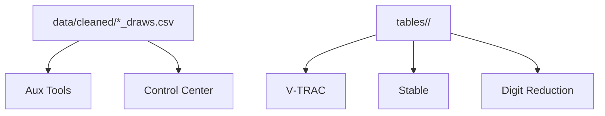

# AAT9 — Diagrams & Visuals Guide

## Why Mermaid
- Text‑based diagrams are easy to version, review, and keep in sync.
- Render in many editors (VS Code previews) and online.

## Where to Put Diagrams
- Prefer embedding Mermaid blocks directly in the relevant doc sections.
- For shared visuals (e.g., app flow), keep them in:
  - `docs/AAT9_DOCS/AAT9_Architecture_Dir_Layout_*.md`
  - Or add a new `docs/diagrams/` folder for multi‑doc reuse, and embed via code blocks.

## Mermaid Examples
````

````

## Update Workflow
1) Make code changes; confirm data paths and page wiring.
2) Update the corresponding Mermaid block in the doc.
3) Preview locally (VS Code Mermaid preview or an online renderer).
4) Add a short entry in the Unified Changelog with a link to the doc/section.

## Tips
- Keep diagrams focused; prefer multiple small diagrams over a single complex one.
- Align diagram labels with function/file names used in the codebase.
- When renaming directories, update both Architecture and App Flow docs.

