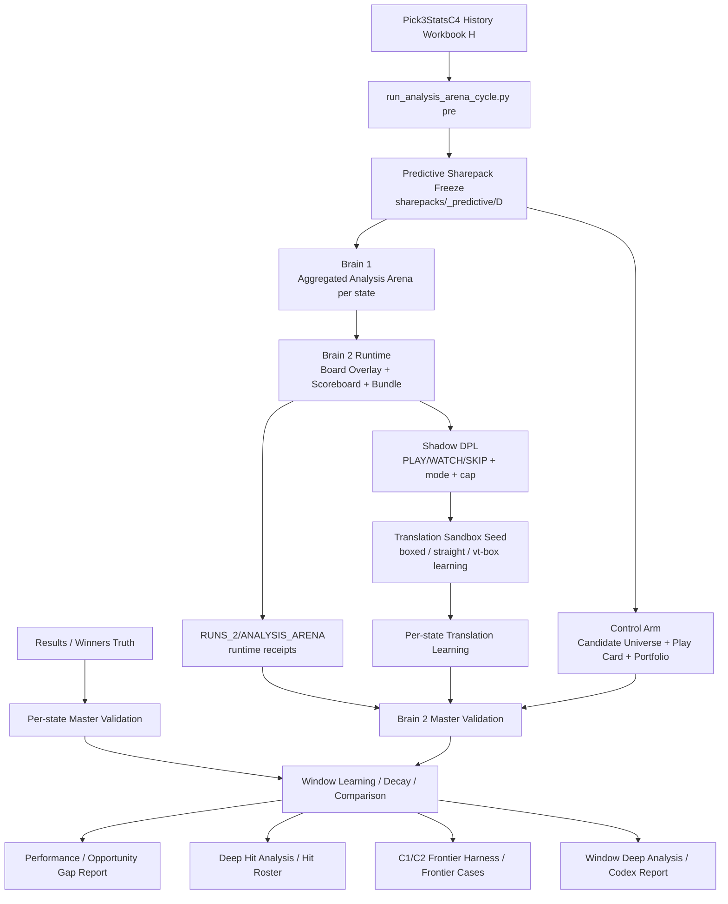

# AAT9 Analysis Arena Operating Flow — Fresh Runs

Date: `2026-03-26`

## Purpose

This document explains the current end-to-end operating flow for the rebuilt
Analysis Arena branch.

Use it when you want a broad, flowchart-style understanding of:

- what the new cadence does
- where sharepacks fit
- how Brain 1 and Brain 2 relate
- where shadow DPL and the translation sandbox sit
- what still remains control-arm only
- how daily runs turn into window learning

---

## Core Idea

The branch now works in this order:

1. freeze the predictive day snapshot
2. build Brain 1 per-state truth
3. build Brain 2 board-level comparison
4. emit shadow DPL posture
5. preserve translation-learning signals
6. keep the old downstream pack stack as a control arm
7. once results exist, run per-state and board-level validation
8. roll windows up and do deeper end-of-window analysis

---

## Flow Diagram



---

## Layer Notes

### Frozen Evidence Layer

- `sharepacks/_predictive/<D>/...`
- this is the immutable predictive-day snapshot
- sharepacks remain the evidence substrate for both daily review and later validation

### Brain 1

- per-state aggregated analysis arena
- dominant canonicals
- dominant families
- dominant VTRAC indices
- survivor and `R-Consensus` context
- local context reinforcement

### Brain 2 Runtime

- board review bundle
- board scoreboard
- spillover overlay
- host vs echo vs shared-host logic

### Shadow DPL

- posture
- mode
- cap class
- translator route
- reason codes

This is still shadow/learning mode, not active final policy.

### Translation Sandbox

- captures near-final cluster intelligence
- boxed / straight / vt-box hypotheses
- preserved-not-budgeted clusters
- shortlist carry-through

This is a learning layer, not live combination forming.

### Control Arm

- Candidate Universe
- Play Card
- portfolio outputs

These are still baseline comparison surfaces.

They are not the definition of arena truth.

---

## Output Homes

Current arena-era output homes:

- runtime receipts:
  - `docs/AAT9_KIT/FINAL VALIDATION/RUNS_2/ANALYSIS_ARENA/`
- human validation and window learning:
  - `docs/AAT9_KIT/FINAL VALIDATION/RUNS_2/`
- frozen predictive evidence:
  - `sharepacks/_predictive/<D>/...`
- historical / legacy comparison:
  - `docs/AAT9_KIT/FINAL VALIDATION/RUNS/`

---

## Operational Reading Order

For a fresh day:

1. board review bundle
2. board scoreboard
3. shadow DPL
4. per-state aggregated analysis arena
5. per-state translation sandbox seed
6. Candidate Universe / Play Card

For post-results:

1. winners truth and per-state Master Validation
2. Brain 2 Master Validation
3. control-arm comparison
4. performance / opportunity gap report
5. deep hit analysis / hit roster
6. C1/C2 frontier harness / frontier cases
7. window deep analysis / Codex report

---

## Current Boundary Conditions

What is real now:

- Brain 1
- Brain 2 runtime
- shadow DPL
- translation sandbox
- per-state Master Validation
- Brain 2 Master Validation

What is still deliberately deferred:

- active arena-native translators
- final combination-forming logic
- budgeting / waging redesign

That is intentional.

The branch is designed to let real fresh-run evidence teach those later layers.

## Window-Close Commands

Once a full window is complete, run:

```bash
python3 scripts/tools/run_analysis_arena_cycle.py window-close --window-root docs/AAT9_KIT/FINAL\ VALIDATION/RUNS_2/WINDOW_<...> --runs-root docs/AAT9_KIT/FINAL\ VALIDATION/RUNS --sharepacks-root sharepacks/_predictive --profile tool_only --experiment-tag arena_v0 --force
```

That gives the branch four different window-close artifacts:

- one quantitative report for arena quality, control-arm realization, and opportunity gap
- one deep converted-hit report for hit class, rank, cost, and arena-finalist signatures
- one winner-HTML frontier harness for C1/C2 survivor / feeder / compression analysis
- one broader narrative report for repeated structures, carryover, tracker families, and promotions
